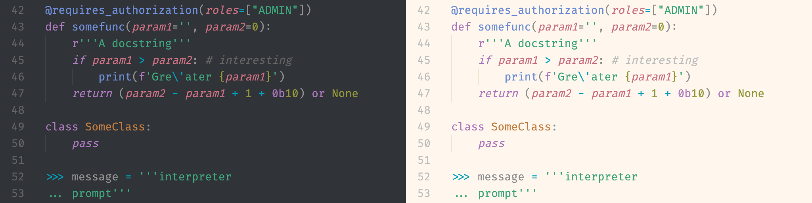
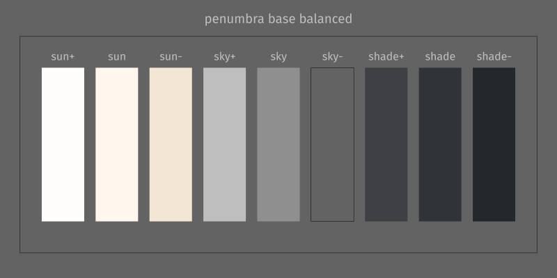
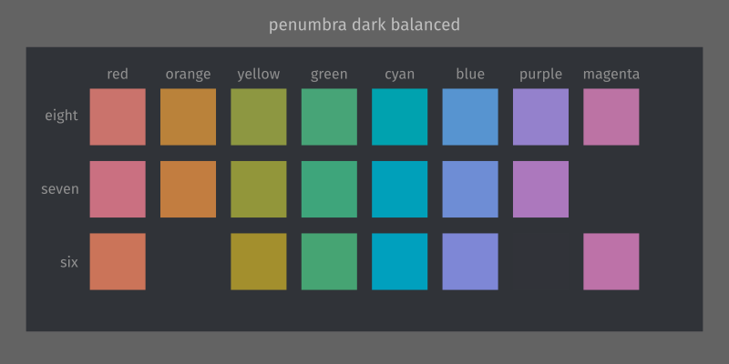
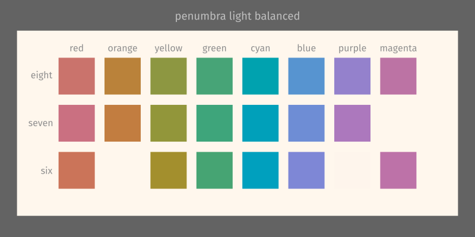
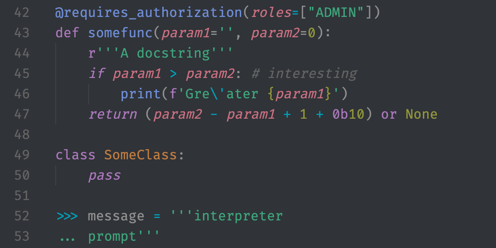
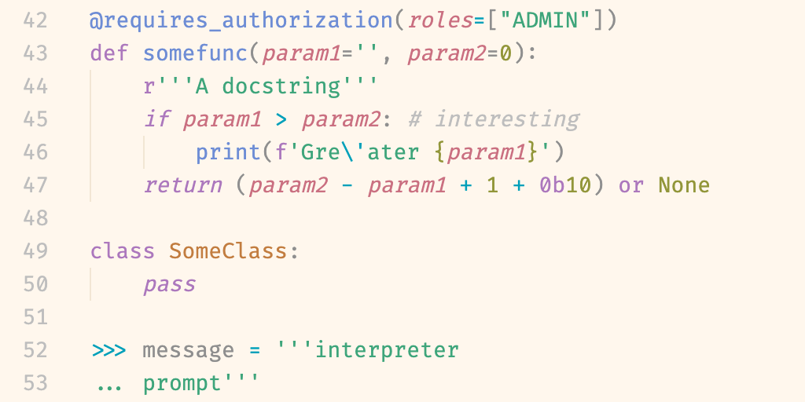
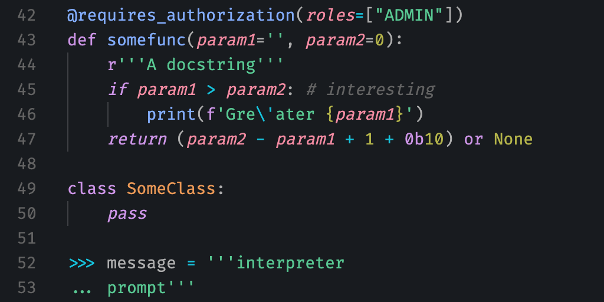

     
 

# Penumbra

Penumbra is a mathematically balanced colour scheme constructed in a perceptually uniform colour space with base colours inspired by the shades of colour occurring in nature due to the light of the sun and the sky. It cleanly separates the perceptual properties of colours while optimally utilizing the available colour space of typical displays.

The nine base colours are (almost fully, see below) symmetric and used to build the main light and dark theme, drawing from differently sized accent colour palettes as necessary. Additionally, there are two variants of the dark theme with enhanced contrast, ideal for anyone with mild to moderate visual impairments. Due to the constraints of the design principles, they are even particularly *unsuitable* for people with colour vision deficiency.

The accent colour palettes also lend themselves to encoding quantitative information in data visualizations.

[penumbra.tsv](penumbra.tsv) contains all colours given below as `rgb_hex`, `r` `g` `b` and `h` `s` `l` in the sRGB colour space, as well as their `oklab_luminance`, indexed by `set`, which is either of `balanced`, `contrast+` and `contrast++`, and `palette`, which is either of `base`, `six`, `seven` and `eight`.

## Features

The goal of this colour scheme is to cleanly separate the use of each of the three perceptual properties of colour — luminance, chroma and hue — and optimally utilize the typically available colour space to encode information with each of them. Function is put before aesthetics, but the base colours inspired by nature and low but sufficient contrast attempt to make the overall scheme pleasing to the eye.

### 1. Base Colours Inspired By Nature

The base colours are derived from the CIE D series of standard illuminants that are modeled after natural daylight (and also used to calibrate the white point of almost all consumer displays), ranging from the evening sun through neutrally white summer daylight to shade and overcast skies. Dark colours appearing like shade and light colours like paper illuminated by sunlight creates an overall pleasing aesthetic that still fades into the background as that’s what you are used to when going outside.

### 2. Just Enough Contrast

Designed to exactly meet the minimum contrast level for legibility on electronic visual displays specified in ISO-9241-3. While legibility is important to reduce eye strain, for many people, too much contrast is also subjectively contributing to it. Enhanced contrast versions -- for anyone with mild or moderate visual impairments respectively -- exceed the minimum contrast recommended by the W3C.

### 3. Optimal Hue Differentiability

By using the perceptually uniform colour space [Oklab](https://bottosson.github.io/posts/oklab), I was able to achieve perceptually uniform hue differences between each of the accent colours, ensuring maximum differentiability between highlighted words. Constant chroma ensures none of them stand out from or recede into the page more than others.

### 4. Fluidly Readable Code

Because the text and accent colours have identical luminance, it’s easier to read code like a continuous text and follow logical syntax while maintaining the ability to scan it for highlighted words with higher chroma.

### 5. Easily Nameable Colours

Within the constraints described above, the colour hues are optimized to produce colours as close as possible to intuitively named colours as found in the [xkcd Color Survey](https://blog.xkcd.com/2010/05/03/color-survey-results/). This makes communicating about the colours just that tiny bit easier and quicker.

## Examples

### Dark

### Light

### Dark Contrast+

### Dark Contrast++

## Available For / Installation

### Editors and IDEs

* **VS Code** available from the [extension marketplace](https://marketplace.visualstudio.com/items?itemName=PenumbraTheme.penumbra), [Open VSX](https://open-vsx.org/extension/PenumbraTheme/penumbra) or its own [repository](https://github.com/nealmckee/penumbra_vscode)
* **Vim** Currently in early draft phase, please help out by testing it [here](https://github.com/nealmckee/penumbra/issues/6)

### Terminal Emulators

* **iTerm2** import itermcolour files from this repository in the preferences pane

### Other

* **JuliaREPL with OhMyREPL** add the Packages OhMyREPL.jl and Crayons.jl to your (base) environment and copy the code from one of the files (corresponding to the desired contrast level) into your startup.jl file
* **R Plotting** install from its own [repository](https://github.com/hughjonesd/penumbra) with `remotes::install_github("hughjonesd/penumbra")`

## Intended Usage

The recommended font is `Fira Code`.

### Base Colours

#### For a dark theme

* **Sun+** “white”, text in highlighted sections, emphasized borders
* **Sun** selections, light borders, strongly emphasized content
* **Sun-** optional
* **Sky+** emphasized content and emphasized UI text
* **Sky** foreground, code, main content colour, text both in editors and UI elements
* **Sky-** comments, de-emphasized content
* **Shade+** foreground UI elements, rulers, indentation guides and similar
* **Shade** main background colour
* **Shade-** “black”, de-emphasized/receded background elements, selections, dark UI elements

#### For a light theme

* **Shade-** “white”, text in highlighted sections, emphasized borders
* **Shade** selections, light borders, strongly emphasized content
* **Shade+** optional
* **Sky-** emphasized content and emphasized UI text
* **Sky** foreground, code, main content colour, text both in editors and UI elements
* **Sky+** comments, de-emphasized content
* **Sun-** foreground UI elements, rulers, indentation guides and similar
* **Sun** main background colour
* **Sun+** “black”, de-emphasized/receded background elements, selections, dark UI elements

When additional in-between shades are desired, it’s recommended to use transparency to blend other appropriate base colours with the background colour.

See the VS Code theme for an example of canonical usage.

### Accent Colour Palettes

Used for syntax highlighting and wherever colour is required in the UI. If avoidable, do not use additional colours in the UI that aren’t required for content highlighting. Usually, context is enough to not confuse their uses -- each additional colour just reduces differentiability.

**Choose one palette (as large as necessary, as small as possible) and never mix and match!** Otherwise, the advantages of hue optimization are lost.

If palettes smaller than 6 are desired, choose subsets as following:

* **5** omit one colour from a six colour palette (**not recommended**)
* **4** every other colour from an eight colour palette (two possible sets)
* **3** every other colour from a six colour palette (two possible sets)
* **2** every third colour from a six colour palette (three possible sets)
* **1** any one colour from a six colour palette (or any palette)

#### Data Visualizations

For qualitative data, choose a palette as described above (balanced for optimum contrast, contrast++ for optimum chroma) for the number of categories in the data. Additionally, if there is adjacency like in a bar chart or pie chart, choose adjacent colours so that the hue difference is maximized. For example for six categories: the colours of a palette of half the size (3), then the other three beginning with the one that is not adjacent to the last (and ending with the one that is not adjacent to the first if adjacency is circular).

This is all meant for your own exploratory visualizations, for publications it is better to use a palette that's safe for people with colour vision deficiency. Penumbra was also specifically designed for electronic displays and not made to be print safe.

## Construction

I implemented transformations from the XYZ colour space to [Oklab](https://bottosson.github.io/posts/oklab/) and from Oklab to sRGB in Julia (and LCH based on Oklab respectively). Combined with Colors.jl, this allowed conversion from any supported colour space to Oklab.

### Base Colors

xy values for a range of correlated colour temperatures (CCT, will be added to the main tsv file in the future) were obtained from an online conversion tool.

For each luminance value, the largest circle of constant luminance and constant chroma colours with varying hues around D65 neutral grey in OKlab still within the sRGB Gamut was approximated numerically (small hue steps instead of a continuous circle, increasing chroma in small increments until reaching the edge). This gave a roughly linear relationship for maximum chroma from 0.0 at L=0.0 to a maximum at approximately L=0.75 back to 0.0 at L=1.0.

Therefore, in order to be able to maximize chroma and with that the distances between the accent colours, the central base colour should be chosen to have as high luminance as possible while still maintaining sufficient contrast (3:1 in accordance with ISO-9241-3) when used for text on the light background colour.

xyY luminance (Y) was tuned by hand (to sufficient precision to exceed integer differences in 8bit sRGB values) for each base colour to achieve symmetrical luminance levels in Oklab.  The second-lightest colour was chosen to be roughly the lightest colour with CCT 5000K within the sRGB gamut, again tuned by hand. Every other colour was arranged symmetrically with few decimal luminance values to obtain the intended contrast for its usage.

This meant that the lightest two colours then would be outside the sRGB gamut, so they were chosen with the correct Oklab hue for the CCT but reduced chroma to fit within sRGB gamut while maintaining approximately the same perceptual differences between neighbors as in the dark colours (in the end slightly larger).

For the higher contrast palettes, some of the medium (including the central colour) and dark colours were moved to multiples of previously used luminance intervals, with matching new CCTs for the dark ones. The exact choices of which luminance differences to maintain and which to increase were dependent on intended usage. This made standard text to background relationships compliant (or very close to it) with W3C guidelines for contrast (AA for contrast+, AAA for contrast+++) without further effort.

### Accent Colour Palettes

The accent colours were obtained by performing the chroma optimization described above, only with a set of n (=palette size) equally spaced colours on a circle of equal chroma and luminance (the latter matching the central base colour) giving mostly slightly higher chroma maxima.

These were repeated with small hue rotation increments (0.1°) and each evaluated according to their CIED2000 colour distance to a hue ordered selection of the most common named colours (red, green, blue, their inverses and the two next most common colours differentiated by hue, not luminance) according to the [xkcd Color Survey](https://blog.xkcd.com/2010/05/03/color-survey-results/).

For each of the three Oklab luminance values and palette sizes, the palette with the least sum root mean squared distances was chosen. For the smaller palettes, the subsets of colours were chosen by hand for 6 (to match terminal colours) and to minimize the minimum sum RMS distances for 7.

## Limitations

Because some base colours have non-zero chroma, the perceptual difference to the accent colours will not be truly uniform. All the base colours are still low in chromaticity though so this was deemed an acceptable trade-off for improved aesthetics. (Compensating for this would break the clean separation of colour properties.)

More generally, Oklab was derived from CAM16 *under normal/average viewing conditions*. When these are not met, uniformity is no longer guaranteed and the balanced dark theme is probably closest to achieving the design goals perfectly. Improvements could only be made by directly using CAM16 to choose colours for every background, screen brightness, ambient light etc. separately. This would explode the complexity of this endeavor. Similar to the rationale given for the derivation of Oklab, it’s in most cases better and more efficient to aim for average viewing conditions rather than provide a myriad of options for any possible scenario.

The xkcd colour survey did not have a representative sample of the world population and the colour names were all in English. Colour naming is strongly influenced by culture, so someone from a very different background might find the choices based on the survey a lot less intuitive. I was not able to find truly representative data of similar quality though any tips would be appreciated. On the plus side, the demographic of potential users of this colour scheme is very likely to largely overlap with the demographic of xkcd readers.

Because differences between the accent colours are solely in hue, people with colour vision deficiency (CVD) will have more difficulty discriminating between them compared to using differences in all properties. Luminance (slightly) and chroma also no longer appear constant since colours are projected onto a plane compared to a trichromat 3D colour space in people with complete bichromacy. In order to provide adequate syntax highlighting, one would have to use both chroma and luminance, making the latter unavailable to encode other information like emphasis and UI structure. This would require a different approach from the ground up.

Some terminal applications rely on the luminance differences between the “traditional” terminal colors both between each other and to foreground and background, most of which are purposefully broken in this color scheme. Nothing becomes entirely unreadable but legibility might suffer drastically. There is no way to account for this while still adhering to the overall design philosophy of this colour scheme. If you regularly use such applications, this scheme is sadly just not for you. Terminal themes also purposefully don’t include “bright” colours as most modern terminal emulators use bold text instead in most cases where these would be required.

## The Colours

### Accent Colour Palettes

|colour | 6 balanced | 7 balanced | 8 balanced
--- | --- | --- | ---
|red    | #CB7459 | #CA7081 | #CA736C |
|orange |         | #C27D40 | #BA823A |
|yellow | #A38F2D | #92963A | #8D9741 |
|green  | #46A473 | #3EA57B | #47A477 |
|cyan   | #00A0BE | #00A0BA | #00A2AF |
|blue   | #7E87D6 | #6E8DD5 | #5794D0 |
|purple |         | #AC78BD | #9481CC |
|magenta| #BD72A8 |         | #BC73A4 |

### Base Colours

|name | balanced
--- | ---
|sun+   | #FFFDFB |
|sun    | #FFF7ED |
|sun-   | #F2E6D4 |
|sky+   | #BEBEBE |
|sky    | #8F8F8F |
|sky-   | #636363 |
|shade+ | #3E4044 |
|shade  | #303338 |
|shade- | #24272B |

### Accent Colour Palettes with Enhanced Brightness and Chroma

|colour | 6 contrast+ | 7 contrast+ | 8 contrast+ | 6 contrast++ | 7 contrast++ | 8 contrast++
--- | --- | --- | --- | --- | --- | ---
|red    | #E18163 | #DF7C8E | #DF7F78 | #F48E74 | #F18AA1 | #F58C81 |
|orange |         | #D68B47 | #CE9042 |         | #EA9856 | #E09F47 |
|yellow | #B49E33 | #A1A641 | #9CA748 | #C7AD40 | #B4B44A | #A9B852 |
|green  | #4EB67F | #44B689 | #50B584 | #61C68A | #58C792 | #54C794 |
|cyan   | #00B0D2 | #00B1CE | #00B3C2 | #1AC2E1 | #16C3DD | #00C4D7 |
|blue   | #8C96EC | #7A9BEC | #61A3E6 | #97A6FF | #83ADFF | #6EB2FD |
|purple |         | #BE85D1 | #A48FE1 |         | #CC94E6 | #B69CF6 |
|magenta| #D07EBA |         | #D080B6 | #E18DCE |         | #E58CC5 |

### Base Colours with Enhanced Contrast

|name | contrast+ | contrast ++
--- | --- | ---
|sun+   | #FFFDFB | #FFFDFB |
|sun    | #FFF7ED | #FFF7ED |
|sun-   | #F2E6D4 | #F2E6D4 |
|sky+   | #CECECE | #DEDEDE |
|sky    | #9E9E9E | #AEAEAE |
|sky-   | #636363 | #636363 |
|shade+ | #3E4044 | #3E4044 |
|shade  | #24272B | #181B1F |
|shade- | #181B1F | #0D0F13 |

## Contributions

Any implementations or ports, as well as improvements and additional feature for existing ones are very welcome. Just submit a pull request here or in the respective repository or create your own.

## Acknowledgments

The search for a theme led me to [Solarized](https://github.com/altercation/solarized) by Ethan Schoonover, which I was ultimately not satisfied with but inspired me to try and improve on its ideas.

[Oklab](https://bottosson.github.io/posts/oklab/) by Björn Ottosson gave me the tools to be able to painlessly design the colours.

The [xkcd Color Survey](https://blog.xkcd.com/2010/05/03/color-survey-results/) provided a quantitative basis for colour names.

[Pluto Notebooks](https://github.com/fonsp/Pluto.jl) with [Colors.jl](https://github.com/JuliaGraphics/Colors.jl) for the Julia language made it effortless to work with colour in a systematic but visual way.

## Contact

TODO
